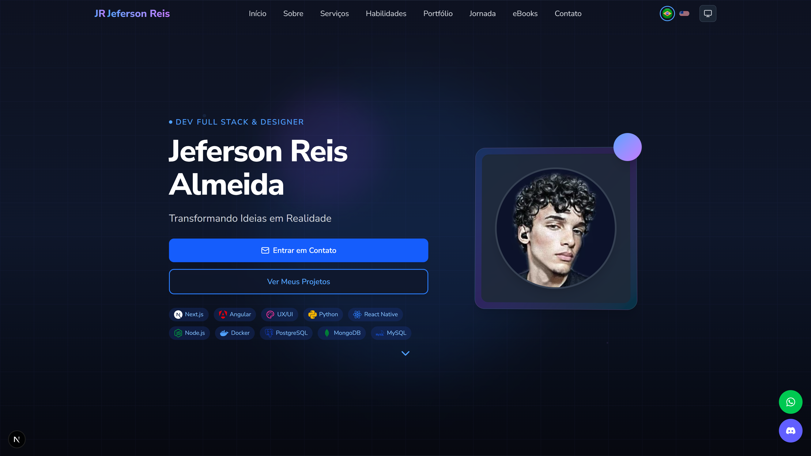

# 🌟 Jeferson Reis - Portfolio Personal

<div align="center">
  
  
  
  <br>
  
  
  
  
</div>

<h1 align="center">
  🚀 Modern Portfolio Website
</h1>

<p align="center">
  Um portfólio pessoal moderno e responsivo construído com <strong>Next.js 15</strong>, <strong>TypeScript</strong> e <strong>Tailwind CSS</strong>, apresentando minha jornada como desenvolvedor full-stack, designer gráfico e técnico em informática.
</p>

<p align="center">
  <a href="https://jefersonreis.dev" target="_blank">
    
  </a>
</p>

<div align="center">
  
</div>

---

## 📋 Índice

- [✨ Sobre o Projeto](#-sobre-o-projeto)
- [🎯 Funcionalidades](#-funcionalidades)
- [🛠️ Stack Tecnológica](#️-stack-tecnológica)
- [🏗️ Arquitetura](#️-arquitetura)
- [🚀 Como Executar](#-como-executar)
- [🎨 Personalização](#-personalização)
- [🌐 Deploy](#-deploy)
- [📊 Performance](#-performance)
- [🤝 Contribuição](#-contribuição)
- [📄 Licença](#-licença)
- [📞 Contato](#-contato)

---

## ✨ Sobre o Projeto

Este é meu portfólio pessoal, desenvolvido para apresentar minha experiência, projetos e habilidades como desenvolvedor full-stack. O site foi construído com foco em:

- **Performance**: Otimizado para velocidade e SEO
- **Acessibilidade**: Seguindo as melhores práticas de a11y
- **Responsividade**: Design adaptativo para todos os dispositivos
- **Experiência do Usuário**: Interface intuitiva e interações fluidas
- **Internacionalização**: Suporte para Português e Inglês

### 🎯 Seções Principais

- **Hero**: Apresentação inicial com call-to-action
- **Sobre**: Informações pessoais e profissionais
- **Áreas de Expertise**: Especialidades e competências
- **Habilidades**: Stack tecnológica com animações
- **Serviços**: Oferta de serviços profissionais
- **Projetos**: Portfolio de trabalhos realizados
- **Jornada**: Timeline da carreira profissional
- **Depoimentos**: Feedbacks de clientes
- **Contato**: Formulário e informações de contato

---

## 🎯 Funcionalidades

### ✅ Recursos Implementados

- ⚡ **Next.js 15** com App Router e React 19
- 🎨 **Sistema de Temas** (Light/Dark/System) com persistência
- 🌍 **Internacionalização (i18n)** PT/EN com next-i18next
- 📱 **Design Responsivo** com Tailwind CSS 4
- 🎭 **Animações Fluidas** com Framer Motion
- 🔍 **SEO Otimizado** com meta tags dinâmicas
- 📊 **Analytics** integrado com Vercel Analytics
- 🚀 **Performance** otimizada (Lighthouse 95+)
- ♿ **Acessibilidade** WCAG 2.1 AA compliant
- 📤 **PWA Ready** com manifest e service workers

### 🎨 Componentes Interativos

- Botões flutuantes (WhatsApp, Discord, Scroll to Top)
- Formulário de contato funcional
- Modal de projetos com navegação
- Carousel de depoimentos
- Nuvem de habilidades animada
- Sistema de filtros no portfólio

---

## 🛠️ Stack Tecnológica

### Frontend Core
| Tecnologia | Versão | Propósito |
|------------|--------|-----------|
| **Next.js** | 15.4.4+ | Framework React para produção |
| **React** | 19.0+ | Biblioteca para UI interativas |
| **TypeScript** | 5+ | Tipagem estática para JavaScript |
| **Tailwind CSS** | 4+ | Framework CSS utility-first |

### Bibliotecas & Utilitários
| Biblioteca | Função |
|------------|---------|
| **Framer Motion** | Animações e transições |
| **next-i18next** | Internacionalização |
| **Lucide React** | Ícones modernos |
| **React Icons** | Biblioteca adicional de ícones |
| **@vercel/analytics** | Analytics e métricas |

### Desenvolvimento & Qualidade
| Ferramenta | Propósito |
|------------|-----------|
| **ESLint** | Linting e padronização |
| **Prettier** | Formatação de código |
| **TypeScript** | Verificação de tipos |
| **PostCSS** | Processamento de CSS |

---

## 🏗️ Arquitetura

### 📁 Estrutura de Diretórios

```
src/
├── components/          # Componentes reutilizáveis
│   ├── Header.tsx      # Navegação principal
│   ├── Footer.tsx      # Rodapé do site
│   ├── SEOHead.tsx     # Meta tags dinâmicas
│   └── ...
├── containers/          # Seções principais da página
│   ├── Hero.tsx        # Seção inicial
│   ├── About.tsx       # Sobre mim
│   ├── Skills.tsx      # Habilidades técnicas
│   └── ...
├── contexts/           # React Contexts
│   └── ThemeContext.tsx # Gerenciamento de tema
├── data/              # Dados estáticos
│   ├── skills.ts      # Lista de habilidades
│   ├── projectsData.ts # Dados dos projetos
│   └── ...
├── pages/             # Páginas Next.js
│   ├── index.tsx      # Página principal
│   ├── _app.tsx       # App personalizado
│   └── api/           # API Routes
├── styles/            # Estilos globais
├── utils/             # Utilitários e helpers
└── i18n/              # Configuração de idiomas
```

### 🎨 Sistema de Temas

O sistema de temas utiliza:
- **React Context** para gerenciamento de estado
- **localStorage** para persistência
- **CSS Variables** para aplicação dinâmica
- **Sistema de cores** com suporte a dark/light mode
- **Detecção automática** de preferência do sistema

### 🌍 Internacionalização

- **Locales suportados**: Português (pt) e Inglês (en)
- **Detecção automática** desabilitada (troca manual)
- **Traduções organizadas** por seção em JSON
- **Fallback** para português como idioma padrão

---

## 🚀 Como Executar

### Pré-requisitos

- **Node.js** 18.17+ ou superior
- **npm** ou **yarn** para gerenciamento de pacotes
- **Git** para controle de versão

### Instalação Local

1. **Clone o repositório**
   ```bash
   git clone https://github.com/Jeffinp/jefersonreis.portifolio.git
   cd jefersonreis.portifolio
   ```

2. **Instale as dependências**
   ```bash
   npm install
   # ou
   yarn install
   ```

3. **Configure as variáveis de ambiente** (opcional)
   ```bash
   cp .env.example .env.local
   # Edite as variáveis conforme necessário
   ```

4. **Execute o servidor de desenvolvimento**
   ```bash
   npm run dev
   # ou
   yarn dev
   ```

5. **Acesse no navegador**
   ```
   http://localhost:3000
   ```

### Scripts Disponíveis

```bash
npm run dev        # Servidor de desenvolvimento
npm run build      # Build de produção
npm run start      # Servidor de produção
npm run lint       # Verificação de código
npm run type-check # Verificação de tipos
npm run analyze    # Análise do bundle
```

---

## 🎨 Personalização

### Modificando Conteúdo

1. **Dados Pessoais**: Edite `/src/data/` para atualizar informações
2. **Traduções**: Modifique `/public/locales/` para alterar textos
3. **Imagens**: Substitua em `/public/assets/images/`
4. **Cores**: Customize em `/src/styles/globals.css`

### Adicionando Seções

1. Crie componente em `/src/containers/`
2. Adicione ao index em `/src/pages/index.tsx`
3. Configure rotas no `/src/components/Header.tsx`
4. Adicione traduções correspondentes

### Temas Customizados

```css
/* src/styles/globals.css */
:root {
  --color-primary: #3b82f6;
  --color-secondary: #8b5cf6;
  /* Adicione suas variáveis */
}
```

---

## 🌐 Deploy

### Deploy na Vercel (Recomendado)

1. **Push para GitHub**
   ```bash
   git push origin main
   ```

2. **Conecte no Vercel**
   - Acesse [vercel.com](https://vercel.com)
   - Importe o repositório
   - Configure variáveis se necessário

3. **Deploy Automático**
   - Cada push dispara novo deploy
   - Preview automático para branches

### Outras Plataformas

- **Netlify**: Compatível com build estático
- **GitHub Pages**: Requer configuração adicional
- **Servidor próprio**: Use `npm run build && npm start`

---

## 📊 Performance

### Métricas de Performance

- **Lighthouse Score**: 95+ em todas as categorias
- **First Contentful Paint**: < 1.5s
- **Largest Contentful Paint**: < 2.5s
- **Cumulative Layout Shift**: < 0.1
- **Time to Interactive**: < 3.8s

### Otimizações Implementadas

- ✅ **Next.js Image** para otimização automática
- ✅ **Code Splitting** automático
- ✅ **Lazy Loading** para componentes
- ✅ **Bundle Analysis** para monitoramento
- ✅ **Static Generation** para páginas
- ✅ **CSS Optimization** com Tailwind CSS

---

## 🤝 Contribuição

Contribuições são bem-vindas! Para contribuir:

1. **Fork** o projeto
2. **Crie** uma branch para sua feature
   ```bash
   git checkout -b feature/MinhaFeature
   ```
3. **Commit** suas mudanças
   ```bash
   git commit -m 'feat: Adiciona nova funcionalidade'
   ```
4. **Push** para a branch
   ```bash
   git push origin feature/MinhaFeature
   ```
5. **Abra** um Pull Request

### Diretrizes

- Siga os padrões de código existentes
- Adicione testes para novas funcionalidades
- Atualize documentação quando necessário
- Use commits semânticos (feat, fix, docs, etc.)

---

## 📄 Licença

Este projeto está sob a licença **MIT**. Veja o arquivo [LICENSE](LICENSE) para mais detalhes.

```
MIT License - você pode usar, modificar e distribuir este código
mantendo os créditos originais.
```

---

## 📞 Contato

<div align="center">

**Jeferson Reis Almeida**  
*Desenvolvedor Full-Stack & Designer Gráfico*

[](mailto:jefersonreisalmeida8356@gmail.com)
[](https://www.linkedin.com/in/jeferson-reis-877a942b7/)
[](https://wa.me/qr/KW2XXA46XAXNH1)
[](https://jefersonreis.dev)

</div>

---

<div align="center">
  <p>
    <strong>⭐ Se este projeto foi útil, considere dar uma estrela!</strong>
  </p>
  <p>
    Feito com ❤️ e muito ☕ por <a href="https://jefersonreis.dev">Jeferson Reis</a>
  </p>
</div>