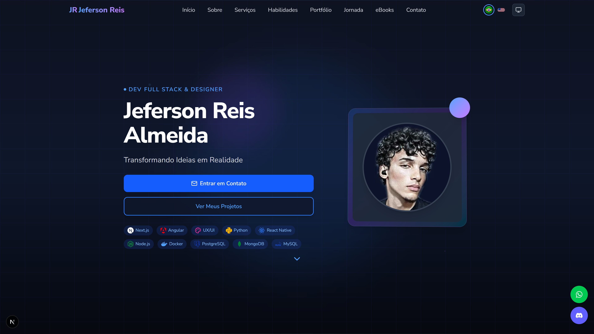

# 🌟 Jeferson Reis - Personal Portfolio

<div align="center">
  
  
  
  <br>
  
  
  
  
</div>

<h1 align="center">
  🚀 Modern Portfolio Website
</h1>

<p align="center">
  A modern and responsive personal portfolio built with <strong>Next.js 15</strong>, <strong>TypeScript</strong>, and <strong>Tailwind CSS</strong>, showcasing my journey as a full-stack developer, graphic designer, and IT technician.
</p>

<p align="center">
  <a href="https://jefersonreis.dev" target="_blank">
    
  </a>
</p>

<div align="center">
  
</div>

---

## 📋 Table of Contents

- [✨ About the Project](#-about-the-project)
- [🎯 Features](#-features)
- [🛠️ Tech Stack](#️-tech-stack)
- [🏗️ Architecture](#️-architecture)
- [🚀 Getting Started](#-getting-started)
- [🎨 Customization](#-customization)
- [🌐 Deployment](#-deployment)
- [📊 Performance](#-performance)
- [🤝 Contributing](#-contributing)
- [📄 License](#-license)
- [📞 Contact](#-contact)

---

## ✨ About the Project

This is my personal portfolio, developed to showcase my experience, projects, and skills as a full-stack developer. The site was built with a focus on:

- **Performance**: Optimized for speed and SEO
- **Accessibility**: Following best a11y practices
- **Responsiveness**: Adaptive design for all devices
- **User Experience**: Intuitive interface and fluid interactions
- **Internationalization**: Support for Portuguese and English

### 🎯 Main Sections

- **Hero**: Initial presentation with call-to-action
- **About**: Personal and professional information
- **Areas of Expertise**: Specialties and competencies
- **Skills**: Technical stack with animations
- **Services**: Professional service offerings
- **Projects**: Portfolio of completed work
- **Journey**: Professional career timeline
- **Testimonials**: Client feedback
- **Contact**: Form and contact information

---

## 🎯 Features

### ✅ Implemented Resources

- ⚡ **Next.js 15** with App Router and React 19
- 🎨 **Theme System** (Light/Dark/System) with persistence
- 🌍 **Internationalization (i18n)** PT/EN with next-i18next
- 📱 **Responsive Design** with Tailwind CSS 4
- 🎭 **Fluid Animations** with Framer Motion
- 🔍 **Optimized SEO** with dynamic meta tags
- 📊 **Analytics** integrated with Vercel Analytics
- 🚀 **Performance** optimized (Lighthouse 95+)
- ♿ **Accessibility** WCAG 2.1 AA compliant
- 📤 **PWA Ready** with manifest and service workers

### 🎨 Interactive Components

- Floating buttons (WhatsApp, Discord, Scroll to Top)
- Functional contact form
- Project modal with navigation
- Testimonial carousel
- Animated skills cloud
- Portfolio filtering system

---

## 🛠️ Tech Stack

### Frontend Core

| Technology       | Version | Purpose                      |
| ---------------- | ------- | ---------------------------- |
| **Next.js**      | 15.4.4+ | Production React framework   |
| **React**        | 19.0+   | Interactive UI library       |
| **TypeScript**   | 5+      | Static typing for JavaScript |
| **Tailwind CSS** | 4+      | Utility-first CSS framework  |

### Libraries & Utilities

| Library               | Function                   |
| --------------------- | -------------------------- |
| **Framer Motion**     | Animations and transitions |
| **next-i18next**      | Internationalization       |
| **Lucide React**      | Modern icons               |
| **React Icons**       | Additional icon library    |
| **@vercel/analytics** | Analytics and metrics      |

### Development & Quality

| Tool           | Purpose                     |
| -------------- | --------------------------- |
| **ESLint**     | Linting and standardization |
| **Prettier**   | Code formatting             |
| **TypeScript** | Type checking               |
| **PostCSS**    | CSS processing              |

---

## 🏗️ Architecture

### 📁 Directory Structure

```
src/
├── components/          # Reusable components
│   ├── Header.tsx      # Main navigation
│   ├── Footer.tsx      # Site footer
│   ├── SEOHead.tsx     # Dynamic meta tags
│   └── ...
├── containers/          # Main page sections
│   ├── Hero.tsx        # Initial section
│   ├── About.tsx       # About me
│   ├── Skills.tsx      # Technical skills
│   └── ...
├── contexts/           # React Contexts
│   └── ThemeContext.tsx # Theme management
├── data/              # Static data
│   ├── skills.ts      # Skills list
│   ├── projectsData.ts # Project data
│   └── ...
├── pages/             # Next.js pages
│   ├── index.tsx      # Main page
│   ├── _app.tsx       # Custom app
│   └── api/           # API Routes
├── styles/            # Global styles
├── utils/             # Utilities and helpers
└── i18n/              # Language configuration
```

### 🎨 Theme System

The theme system uses:

- **React Context** for state management
- **localStorage** for persistence
- **CSS Variables** for dynamic application
- **Color system** with dark/light mode support
- **Automatic detection** of system preference

### 🌍 Internationalization

- **Supported locales**: Portuguese (pt) and English (en)
- **Automatic detection** disabled (manual switching)
- **Organized translations** by section in JSON
- **Fallback** to Portuguese as default language

---

## 🚀 Getting Started

### Prerequisites

- **Node.js** 18.17+ or higher
- **npm** or **yarn** for package management
- **Git** for version control

### Local Installation

1. **Clone the repository**

   ```bash
   git clone https://github.com/Jeffinp/jefersonreis.portifolio.git
   cd jefersonreis.portifolio
   ```

2. **Install dependencies**

   ```bash
   npm install
   # or
   yarn install
   ```

3. **Configure environment variables** (optional)

   ```bash
   cp .env.example .env.local
   # Edit variables as needed
   ```

4. **Run the development server**

   ```bash
   npm run dev
   # or
   yarn dev
   ```

5. **Access in browser**
   ```
   http://localhost:3000
   ```

### Available Scripts

```bash
npm run dev        # Development server
npm run build      # Production build
npm run start      # Production server
npm run lint       # Code verification
npm run type-check # Type checking
npm run analyze    # Bundle analysis
```

---

## 🎨 Customization

### Modifying Content

1. **Personal Data**: Edit `/src/data/` to update information
2. **Translations**: Modify `/public/locales/` to change text
3. **Images**: Replace in `/public/assets/images/`
4. **Colors**: Customize in `/src/styles/globals.css`

### Adding Sections

1. Create component in `/src/containers/`
2. Add to index in `/src/pages/index.tsx`
3. Configure routes in `/src/components/Header.tsx`
4. Add corresponding translations

### Custom Themes

```css
/* src/styles/globals.css */
:root {
  --color-primary: #3b82f6;
  --color-secondary: #8b5cf6;
  /* Add your variables */
}
```

---

## 🌐 Deployment

### Deploy on Vercel (Recommended)

1. **Push to GitHub**

   ```bash
   git push origin main
   ```

2. **Connect on Vercel**
   - Go to [vercel.com](https://vercel.com)
   - Import the repository
   - Configure variables if needed

3. **Automatic Deployment**
   - Each push triggers a new deployment
   - Automatic preview for branches

### Other Platforms

- **Netlify**: Compatible with static build
- **GitHub Pages**: Requires additional configuration
- **Own server**: Use `npm run build && npm start`

---

## 📊 Performance

### Performance Metrics

- **Lighthouse Score**: 95+ in all categories
- **First Contentful Paint**: < 1.5s
- **Largest Contentful Paint**: < 2.5s
- **Cumulative Layout Shift**: < 0.1
- **Time to Interactive**: < 3.8s

### Implemented Optimizations

- ✅ **Next.js Image** for automatic optimization
- ✅ **Code Splitting** automatic
- ✅ **Lazy Loading** for components
- ✅ **Bundle Analysis** for monitoring
- ✅ **Static Generation** for pages
- ✅ **CSS Optimization** with Tailwind CSS

---

## 🤝 Contributing

Contributions are welcome! To contribute:

1. **Fork** the project
2. **Create** a branch for your feature
   ```bash
   git checkout -b feature/MyFeature
   ```
3. **Commit** your changes
   ```bash
   git commit -m 'feat: Add new functionality'
   ```
4. **Push** to the branch
   ```bash
   git push origin feature/MyFeature
   ```
5. **Open** a Pull Request

### Guidelines

- Follow existing code standards
- Add tests for new features
- Update documentation when necessary
- Use semantic commits (feat, fix, docs, etc.)

---

## 📄 License

This project is under the **MIT** license. See the [LICENSE](LICENSE) file for more details.

```
MIT License - you can use, modify, and distribute this code
while maintaining the original credits.
```

---

## 📞 Contact

<div align="center">

**Jeferson Reis Almeida**  
_Full-Stack Developer & Graphic Designer_

[](mailto:jefersonreisalmeida8356@gmail.com)
[](https://www.linkedin.com/in/jeferson-reis-877a942b7/)
[](https://wa.me/qr/KW2XXA46XAXNH1)
[](https://jefersonreis.dev)

</div>

---

<div align="center">
  <p>
    <strong>⭐ If this project was helpful, consider giving it a star!</strong>
  </p>
  <p>
    Made with ❤️ and lots of ☕ by <a href="https://jefersonreis.dev">Jeferson Reis</a>
  </p>
</div>
